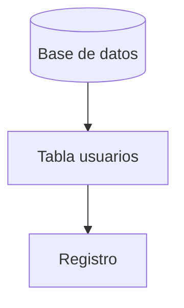

# Introducción a las bases de datos

Las bases de datos permiten almacenar información de forma organizada y garantizan la integridad de los datos. En el modelo relacional los datos se estructuran en tablas compuestas por filas (registros) y columnas (campos), y las relaciones se establecen mediante claves primarias y foráneas.

## Ejemplo
```sql
-- Creación y consulta de una tabla
CREATE TABLE usuarios (
  id SERIAL PRIMARY KEY,
  nombre TEXT,
  email TEXT
);
INSERT INTO usuarios(nombre, email) VALUES ('Ana', 'ana@example.com');
SELECT * FROM usuarios;
```

## Diagrama

