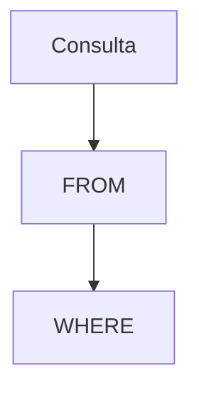

# Fundamentos de SQL

SQL es un lenguaje declarativo diseñado para gestionar datos en sistemas relacionales. Se compone de sublenguajes como DDL para definir estructuras, DML para manipular datos y DQL para realizar consultas. La sintaxis se basa en sentencias que describen qué datos se desean y no cómo obtenerlos.

## Ejemplo
```sql
-- Consulta y actualización de registros
SELECT nombre FROM usuarios WHERE id = 1;
UPDATE usuarios SET nombre = 'Juan' WHERE id = 1;
```

## Diagrama

