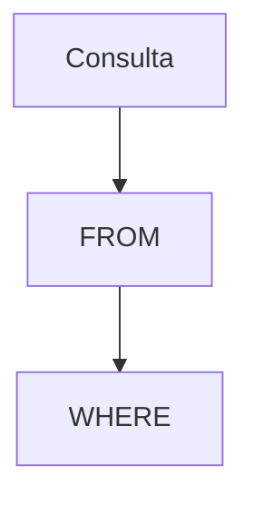

# Fundamentos de SQL

SQL es un lenguaje declarativo para interactuar con bases de datos relacionales usando sentencias como SELECT, INSERT, UPDATE y DELETE.

## Ejemplo
```sql
SELECT nombre FROM usuarios;
```

## Diagrama

