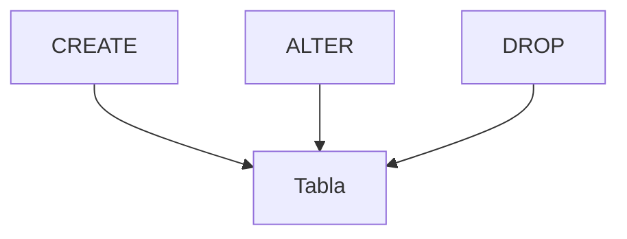

# Lenguaje de definición de datos (DDL)

El DDL se utiliza para crear y modificar la estructura de la base de datos. Con sentencias como `CREATE`, `ALTER` y `DROP` se definen tablas, vistas e índices que determinan cómo se almacenan los datos. Estas operaciones suelen requerir permisos elevados porque afectan al esquema global.

## Ejemplo
```sql
CREATE TABLE productos (
  id SERIAL PRIMARY KEY,
  nombre TEXT NOT NULL
);
ALTER TABLE productos ADD COLUMN precio NUMERIC;
DROP TABLE productos;
```

## Diagrama

