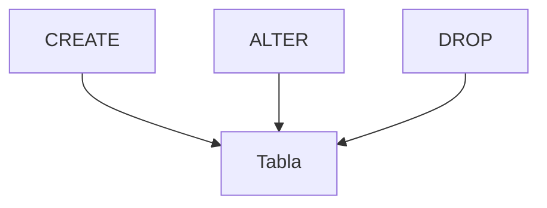

# Lenguaje de definición de datos (DDL)

El DDL se utiliza para crear y modificar la estructura de la base de datos. Con sentencias como `CREATE`, `ALTER` y `DROP` se definen tablas, vistas e índices que determinan cómo se almacenan los datos. Estas operaciones suelen requerir permisos elevados porque afectan al esquema global.

## Preparación
Trabajaremos sobre la base `tienda` creada en el módulo anterior, que ya cuenta con la tabla `usuarios`.
Conéctate a ella antes de ejecutar los ejemplos:

```sql
\c tienda
```

En los siguientes ejemplos crearemos nuevas tablas que se usarán en módulos posteriores.

## Ejemplo
```sql
CREATE TABLE productos (
  id SERIAL PRIMARY KEY,
  nombre TEXT NOT NULL
);
ALTER TABLE productos ADD COLUMN precio NUMERIC;
DROP TABLE productos;
```

## Diagrama


### CREATE
Permite definir nuevos objetos en el esquema de la base de datos.

```sql
CREATE TABLE categorias (
  id SERIAL PRIMARY KEY,
  nombre TEXT NOT NULL
);
```

**Ejercicio**

Crear una tabla `categorias` con una columna `id` y otra `nombre`.

**Solución paso a paso**

1. Elegir el nombre de la tabla: `categorias`.
2. Definir la columna `id` como clave primaria con `SERIAL`.
3. Añadir la columna `nombre` como texto obligatorio.
4. Ejecutar:
   `CREATE TABLE categorias (id SERIAL PRIMARY KEY, nombre TEXT NOT NULL);`.

### ALTER
Modifica la estructura de un objeto existente.

```sql
ALTER TABLE categorias ADD COLUMN descripcion TEXT;
```

**Ejercicio**

Agregar una columna `descripcion` de tipo texto a la tabla `categorias`.

**Solución paso a paso**

1. Determinar la tabla a alterar: `categorias`.
2. Usar la sentencia `ALTER TABLE` con `ADD COLUMN`.
3. Especificar la nueva columna `descripcion TEXT`.
4. Ejecutar:
   `ALTER TABLE categorias ADD COLUMN descripcion TEXT;`.

### DROP
Elimina objetos del esquema de forma permanente.

```sql
DROP TABLE categorias;
```

**Ejercicio**

Eliminar la tabla `categorias` creada previamente.

**Solución paso a paso**

1. Confirmar que la tabla a borrar es `categorias`.
2. Utilizar la sentencia `DROP TABLE` sobre esa tabla.
3. Ejecutar:
   `DROP TABLE categorias;`.

