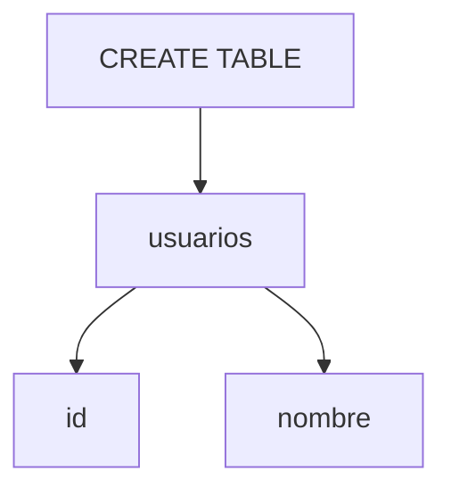

# Lenguaje de Definición de Datos (DDL)

El DDL se usa para crear y modificar estructuras de la base de datos con comandos como CREATE, ALTER y DROP.

## Ejemplo
```sql
CREATE TABLE usuarios (
  id INT PRIMARY KEY,
  nombre TEXT
);
```

## Diagrama

