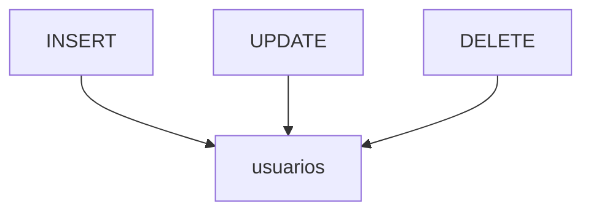

# Lenguaje de Manipulación de Datos (DML)

El DML se emplea para gestionar la información almacenada en las tablas. Con `INSERT` se añaden registros, `UPDATE` permite modificarlos y `DELETE` los elimina. Estas operaciones se pueden agrupar en transacciones para garantizar la coherencia de los datos.

## Ejemplo
```sql
-- Operaciones básicas sobre una tabla
INSERT INTO usuarios (id, nombre) VALUES (1, 'Ana');
UPDATE usuarios SET nombre = 'Ana María' WHERE id = 1;
DELETE FROM usuarios WHERE id = 1;
```

## Diagrama

