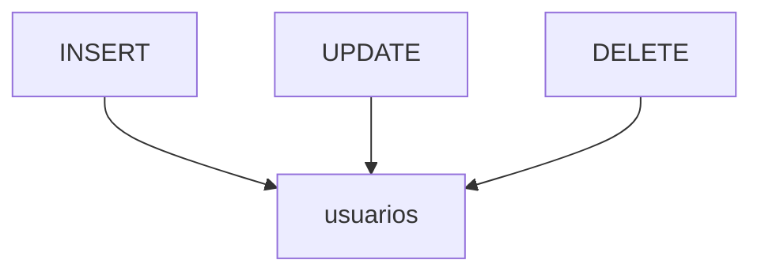

# Lenguaje de Manipulación de Datos (DML)

El DML se emplea para gestionar la información almacenada en las tablas. Con `INSERT` se añaden registros, `UPDATE` permite modificarlos y `DELETE` los elimina. Estas operaciones se pueden agrupar en transacciones para garantizar la coherencia de los datos.

## Preparación
Usaremos la base `tienda` y la tabla `usuarios` creadas previamente.
Si necesitas datos de prueba, inserta algunos registros iniciales:

```sql
INSERT INTO usuarios (nombre, correo, edad, activo, ciudad) VALUES
('Ana', 'ana@example.com', 25, TRUE, 'Madrid'),
('Luis', 'luis@example.com', 32, TRUE, 'Bogotá'),
('Marta', 'marta@example.com', 40, FALSE, 'Buenos Aires');
```

## Ejemplo
```sql
-- Operaciones básicas sobre una tabla
INSERT INTO usuarios (id, nombre) VALUES (1, 'Ana');
UPDATE usuarios SET nombre = 'Ana María' WHERE id = 1;
DELETE FROM usuarios WHERE id = 1;
```

## Diagrama


### INSERT
Añade nuevos registros a la tabla especificada.

```sql
INSERT INTO usuarios (nombre, correo)
VALUES ('Laura', 'laura@example.com');
```

**Ejercicio**

Insertar un usuario llamado `Mario` con correo `mario@example.com` en la tabla `usuarios`.

**Solución paso a paso**

1. Identificar la tabla de destino: `usuarios`.
2. Enumerar las columnas a completar: `nombre` y `correo`.
3. Escribir los valores correspondientes entre paréntesis.
4. Ejecutar:
   `INSERT INTO usuarios (nombre, correo) VALUES ('Mario', 'mario@example.com');`.

### UPDATE
Modifica datos existentes que cumplen una condición.

```sql
UPDATE usuarios
SET correo = 'nuevo@example.com'
WHERE id = 1;
```

**Ejercicio**

Actualizar el nombre a `María` para el usuario con `id = 3`.

**Solución paso a paso**

1. Seleccionar la tabla que contiene el registro: `usuarios`.
2. Indicar la columna a modificar: `nombre`.
3. Establecer la condición `id = 3`.
4. Ejecutar:
   `UPDATE usuarios SET nombre = 'María' WHERE id = 3;`.

### DELETE
Elimina registros que cumplen la condición indicada.

```sql
DELETE FROM usuarios WHERE id = 1;
```

**Ejercicio**

Borrar todos los usuarios con el campo `activo` en `FALSE`.

**Solución paso a paso**

1. Determinar la tabla de la que se eliminarán registros: `usuarios`.
2. Definir la condición de eliminación `activo = FALSE`.
3. Ejecutar:
   `DELETE FROM usuarios WHERE activo = FALSE;`.

