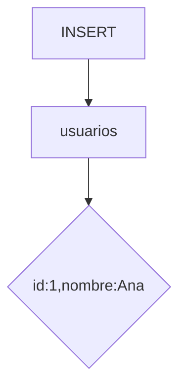

# Lenguaje de Manipulación de Datos (DML)

El DML permite insertar, actualizar y eliminar registros mediante comandos INSERT, UPDATE y DELETE.

## Ejemplo
```sql
INSERT INTO usuarios (id, nombre) VALUES (1, 'Ana');
```

## Diagrama

