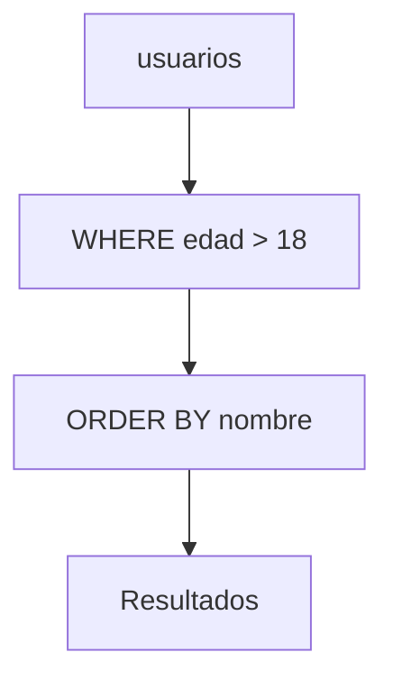

# Consultas básicas

Las consultas permiten recuperar información de las tablas usando la sentencia `SELECT`. Se pueden aplicar filtros con `WHERE`, ordenar con `ORDER BY` y limitar resultados con `LIMIT`. Estas operaciones conforman el punto de partida para cualquier interacción con la base de datos.

## Ejemplo
```sql
SELECT nombre
FROM usuarios
WHERE edad > 18
ORDER BY nombre ASC
LIMIT 10;
```

## Diagrama

