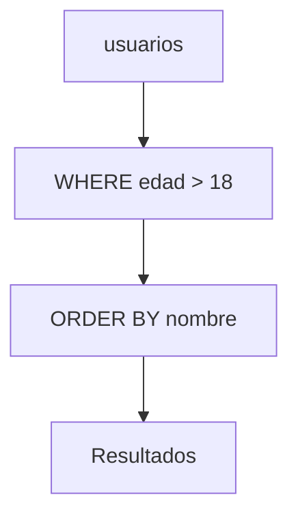

# Consultas básicas

Las consultas permiten recuperar información de las tablas usando la sentencia `SELECT`. Se pueden aplicar filtros con `WHERE`, ordenar con `ORDER BY` y limitar resultados con `LIMIT`. Estas operaciones conforman el punto de partida para cualquier interacción con la base de datos.

## Preparación
Reutilizaremos la base `tienda` y la tabla `usuarios` poblada en los módulos anteriores.
Si aún no las tienes, vuelve a la sección de Fundamentos para crear la base y los registros de ejemplo.

## Ejemplo
```sql
SELECT nombre
FROM usuarios
WHERE edad > 18
ORDER BY nombre ASC
LIMIT 10;
```

## Diagrama


### WHERE
Filtra las filas que cumplen una condición específica.

```sql
SELECT * FROM usuarios WHERE activo = TRUE;
```

**Ejercicio**

Listar los nombres de los usuarios cuya edad sea mayor a 30.

**Solución paso a paso**

1. Indicar las columnas requeridas: `nombre`.
2. Usar `FROM usuarios` para señalar la tabla.
3. Aplicar la condición `edad > 30` con `WHERE`.
4. Ejecutar:
   `SELECT nombre FROM usuarios WHERE edad > 30;`.

### ORDER BY
Ordena los resultados según una o más columnas.

```sql
SELECT nombre FROM usuarios ORDER BY nombre DESC;
```

**Ejercicio**

Obtener los usuarios ordenados por `edad` de mayor a menor.

**Solución paso a paso**

1. Seleccionar la columna `edad` junto con `nombre`.
2. Añadir la cláusula `ORDER BY edad DESC`.
3. Ejecutar:
   `SELECT nombre, edad FROM usuarios ORDER BY edad DESC;`.

### LIMIT
Restringe la cantidad de filas devueltas.

```sql
SELECT nombre FROM usuarios LIMIT 5;
```

**Ejercicio**

Mostrar solo los primeros 3 usuarios de la tabla.

**Solución paso a paso**

1. Elegir las columnas a mostrar: `nombre`.
2. Usar `LIMIT 3` para limitar los resultados.
3. Ejecutar:
   `SELECT nombre FROM usuarios LIMIT 3;`.

