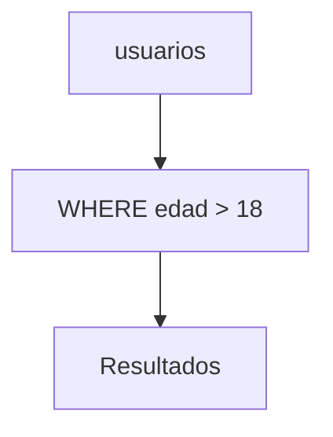

# Consultas básicas

Las consultas básicas recuperan datos con SELECT y pueden filtrar resultados con WHERE.

## Ejemplo
```sql
SELECT nombre FROM usuarios WHERE edad > 18;
```

## Diagrama

```mermaid
graph TD;
  T[usuarios] --> F[WHERE edad > 18];
  F --> R[Resultados];
```
