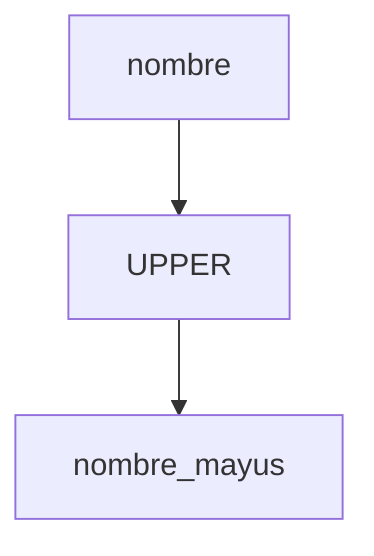

# Funciones y expresiones

Las funciones permiten realizar cálculos o transformaciones sobre los datos, como cambiar el formato de texto o sumar valores. Las expresiones combinan columnas, literales y operadores para generar nuevos resultados.

## Ejemplo
```sql
SELECT id,
       UPPER(nombre) AS nombre_mayus,
       edad + 1 AS edad_siguiente
FROM usuarios;
```

## Diagrama

