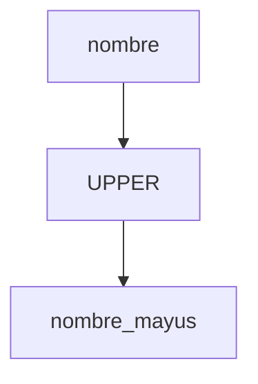

# Funciones y expresiones

Las funciones permiten realizar cálculos o transformaciones sobre los datos, como cambiar el formato de texto o sumar valores. Las expresiones combinan columnas, literales y operadores para generar nuevos resultados.

## Preparación
Continuamos trabajando en la base `tienda` usando la tabla `usuarios` con los registros creados previamente.

## Ejemplo
```sql
SELECT id,
       UPPER(nombre) AS nombre_mayus,
       edad + 1 AS edad_siguiente
FROM usuarios;
```

## Diagrama


### UPPER
Convierte una cadena de texto a mayúsculas.

```sql
SELECT UPPER(nombre) AS nombre_mayus FROM usuarios;
```

**Ejercicio**

Mostrar los correos electrónicos en mayúsculas para todos los usuarios.

**Solución paso a paso**

1. Seleccionar la columna `correo` de la tabla `usuarios`.
2. Aplicar la función `UPPER` sobre `correo`.
3. Asignar un alias si se desea: `AS correo_mayus`.
4. Ejecutar:
   `SELECT UPPER(correo) AS correo_mayus FROM usuarios;`.

### Operaciones aritméticas
Permiten calcular valores numéricos combinando columnas y constantes.

```sql
SELECT nombre, edad + 1 AS edad_siguiente FROM usuarios;
```

**Ejercicio**

Obtener el doble de la columna `edad` para cada usuario.

**Solución paso a paso**

1. Indicar las columnas `nombre` y `edad` de la tabla `usuarios`.
2. Construir la expresión `edad * 2`.
3. Asignar un alias opcional `AS edad_doble`.
4. Ejecutar:
   `SELECT nombre, edad * 2 AS edad_doble FROM usuarios;`.

