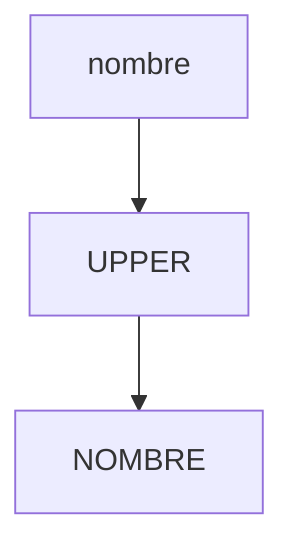

# Funciones y expresiones

Las funciones permiten transformar datos, y las expresiones combinan columnas y valores.

## Ejemplo
```sql
SELECT UPPER(nombre) FROM usuarios;
```

## Diagrama

```mermaid
graph TD;
  N[nombre] --> U[UPPER];
  U --> R[NOMBRE];
```
