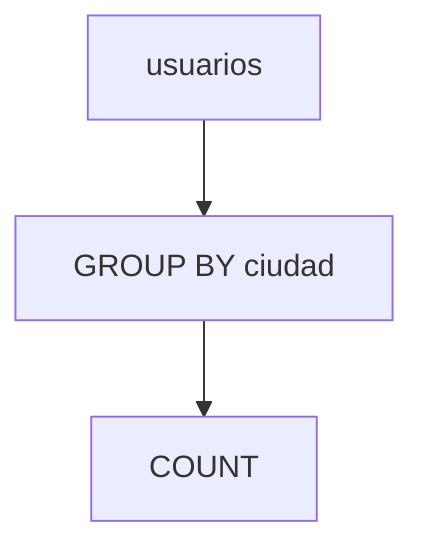

# Agregaciones y agrupamientos

Las funciones de agregación como `COUNT`, `SUM` o `AVG` permiten resumir grandes cantidades de datos. El uso de `GROUP BY` agrupa filas que comparten valores y `HAVING` filtra sobre los grupos resultantes.

## Preparación
Usaremos la base `tienda` y la tabla `usuarios` con los registros añadidos en módulos anteriores.

## Ejemplo
```sql
SELECT ciudad,
       COUNT(*) AS total
FROM usuarios
GROUP BY ciudad
HAVING COUNT(*) > 5;
```

## Diagrama


### COUNT
Cuenta la cantidad de filas en una consulta o grupo.

```sql
SELECT COUNT(*) AS total_usuarios FROM usuarios;
```

**Ejercicio**

Calcular cuántos usuarios están marcados como activos.

**Solución paso a paso**

1. Seleccionar desde la tabla `usuarios`.
2. Aplicar `COUNT(*)` con una condición `WHERE activo = TRUE`.
3. Ejecutar:
   `SELECT COUNT(*) FROM usuarios WHERE activo = TRUE;`.

### GROUP BY
Agrupa filas que comparten un mismo valor para aplicar agregaciones.

```sql
SELECT ciudad, COUNT(*) AS total FROM usuarios GROUP BY ciudad;
```

**Ejercicio**

Obtener el número de usuarios por cada ciudad registrada.

**Solución paso a paso**

1. Incluir las columnas `ciudad` y `COUNT(*)` en el `SELECT`.
2. Usar `GROUP BY ciudad` para crear los grupos.
3. Ejecutar:
   `SELECT ciudad, COUNT(*) FROM usuarios GROUP BY ciudad;`.

### HAVING
Filtra resultados después de agrupar.

```sql
SELECT ciudad, COUNT(*)
FROM usuarios
GROUP BY ciudad
HAVING COUNT(*) > 5;
```

**Ejercicio**

Listar las ciudades que tengan más de 10 usuarios registrados.

**Solución paso a paso**

1. Crear la consulta agrupada por `ciudad` con `COUNT(*)`.
2. Añadir `HAVING COUNT(*) > 10` para filtrar los grupos.
3. Ejecutar:
   `SELECT ciudad, COUNT(*) FROM usuarios GROUP BY ciudad HAVING COUNT(*) > 10;`.

