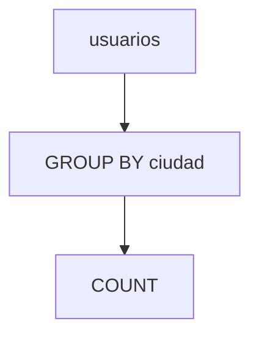

# Agregaciones y agrupamientos

Las funciones de agregación como `COUNT`, `SUM` o `AVG` permiten resumir grandes cantidades de datos. El uso de `GROUP BY` agrupa filas que comparten valores y `HAVING` filtra sobre los grupos resultantes.

## Ejemplo
```sql
SELECT ciudad,
       COUNT(*) AS total
FROM usuarios
GROUP BY ciudad
HAVING COUNT(*) > 5;
```

## Diagrama

