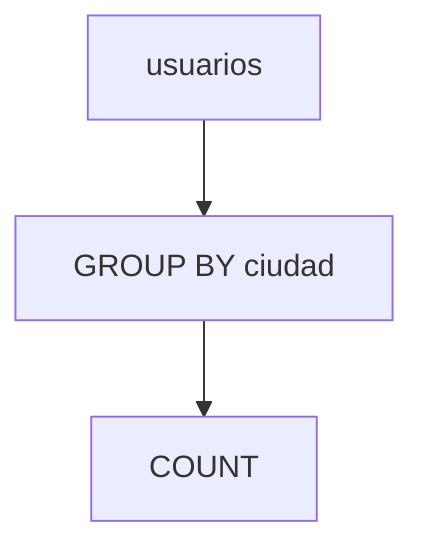

# Agregaciones y agrupamientos

Las funciones de agregación resumen datos y GROUP BY agrupa filas con valores comunes.

## Ejemplo
```sql
SELECT ciudad, COUNT(*) FROM usuarios GROUP BY ciudad;
```

## Diagrama

