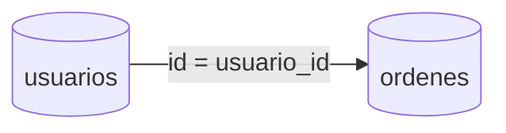

# Joins y combinaciones de tablas

Los `JOIN` permiten consultar datos distribuidos en varias tablas combinando filas relacionadas. Existen diferentes tipos como `INNER`, `LEFT`, `RIGHT` y `FULL`, cada uno con reglas de inclusión de filas.

## Ejemplo
```sql
SELECT u.nombre, o.total
FROM usuarios u
LEFT JOIN ordenes o ON u.id = o.usuario_id;
```

## Diagrama

