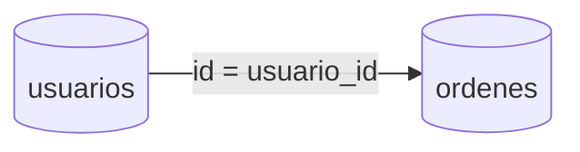

# Joins y combinaciones de tablas

Los `JOIN` permiten consultar datos distribuidos en varias tablas combinando filas relacionadas. Existen diferentes tipos como `INNER`, `LEFT`, `RIGHT` y `FULL`, cada uno con reglas de inclusión de filas.

## Preparación
Trabajaremos con la base `tienda` y la tabla `usuarios` ya creada. Para este módulo añade una tabla `ordenes` relacionada con `usuarios`:

```sql
\c tienda
CREATE TABLE ordenes (
  id SERIAL PRIMARY KEY,
  usuario_id INT REFERENCES usuarios(id),
  total NUMERIC
);

INSERT INTO ordenes (usuario_id, total) VALUES
(1, 150), (1, 80), (2, 200);
```

## Ejemplo
```sql
SELECT u.nombre, o.total
FROM usuarios u
LEFT JOIN ordenes o ON u.id = o.usuario_id;
```

## Diagrama


### INNER JOIN
Devuelve filas cuando existe coincidencia en ambas tablas.

```sql
SELECT u.nombre, o.total
FROM usuarios u
INNER JOIN ordenes o ON u.id = o.usuario_id;
```

**Ejercicio**

Obtener los nombres de los usuarios y el total de sus órdenes solo si tienen al menos una.

**Solución paso a paso**

1. Seleccionar las columnas `u.nombre` y `o.total`.
2. Especificar las tablas `usuarios u` y `ordenes o`.
3. Unirlas con `INNER JOIN` usando `u.id = o.usuario_id`.
4. Ejecutar la consulta anterior.

### LEFT JOIN
Incluye todas las filas de la tabla izquierda aunque no haya coincidencias.

```sql
SELECT u.nombre, o.total
FROM usuarios u
LEFT JOIN ordenes o ON u.id = o.usuario_id;
```

**Ejercicio**

Listar todos los usuarios y mostrar `NULL` en el total cuando no tengan órdenes.

**Solución paso a paso**

1. Elegir `usuarios` como tabla principal.
2. Aplicar `LEFT JOIN` con `ordenes` mediante `u.id = o.usuario_id`.
3. Seleccionar `u.nombre` y `o.total`.
4. Ejecutar la consulta:
   `SELECT u.nombre, o.total FROM usuarios u LEFT JOIN ordenes o ON u.id = o.usuario_id;`.

### RIGHT JOIN
Incluye todas las filas de la tabla derecha sin importar coincidencias.

```sql
SELECT u.nombre, o.total
FROM usuarios u
RIGHT JOIN ordenes o ON u.id = o.usuario_id;
```

**Ejercicio**

Mostrar todas las órdenes junto con el nombre del usuario si existe.

**Solución paso a paso**

1. Escoger `ordenes` como tabla que debe aparecer completa.
2. Usar `RIGHT JOIN` con `usuarios` mediante `u.id = o.usuario_id`.
3. Seleccionar `o.total` y `u.nombre`.
4. Ejecutar:
   `SELECT u.nombre, o.total FROM usuarios u RIGHT JOIN ordenes o ON u.id = o.usuario_id;`.

