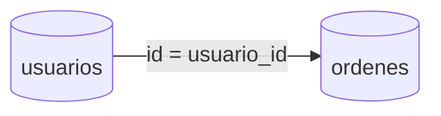

# Joins y combinaciones de tablas

Los JOINS unen datos de múltiples tablas relacionando columnas comunes.

## Ejemplo
```sql
SELECT u.nombre, o.total
FROM usuarios u
JOIN ordenes o ON u.id = o.usuario_id;
```

## Diagrama

