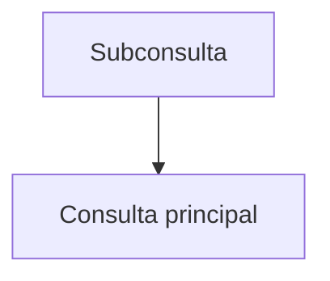

# Subconsultas

Una subconsulta es una consulta dentro de otra que proporciona datos al exterior.

## Ejemplo
```sql
SELECT nombre FROM usuarios WHERE id IN (SELECT usuario_id FROM ordenes);
```

## Diagrama

