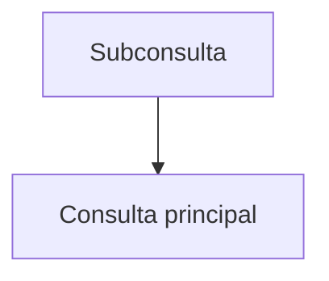

# Subconsultas

Una subconsulta es una instrucción `SELECT` anidada dentro de otra consulta. Puede utilizarse en `WHERE`, `FROM` o `SELECT` y puede ser correlacionada cuando depende de la fila externa.

## Preparación
Usaremos las tablas `usuarios` y `ordenes` de la base `tienda` preparadas en los módulos anteriores.

## Ejemplo
```sql
SELECT nombre
FROM usuarios
WHERE id IN (
  SELECT usuario_id FROM ordenes WHERE total > 100
);
```

## Diagrama


### Subconsulta en WHERE
Permite usar el resultado de otra consulta como filtro.

```sql
SELECT nombre
FROM usuarios
WHERE id IN (SELECT usuario_id FROM ordenes);
```

**Ejercicio**

Listar los usuarios que hayan realizado alguna orden con total mayor a 100.

**Solución paso a paso**

1. Crear una subconsulta que obtenga `usuario_id` de `ordenes` con `total > 100`.
2. Usar `IN` en la consulta principal para filtrar los `id` obtenidos.
3. Ejecutar:
   `SELECT nombre FROM usuarios WHERE id IN (SELECT usuario_id FROM ordenes WHERE total > 100);`.

### Subconsulta en FROM
Utiliza una consulta como tabla derivada.

```sql
SELECT sub.usuario_id, sub.total
FROM (
  SELECT usuario_id, SUM(total) AS total
  FROM ordenes
  GROUP BY usuario_id
) sub;
```

**Ejercicio**

Obtener la suma de totales por usuario usando una subconsulta en el `FROM`.

**Solución paso a paso**

1. Construir la subconsulta que agrupe `ordenes` por `usuario_id` y sume `total`.
2. Asignarle un alias, por ejemplo `sub`.
3. Seleccionar desde la tabla derivada.
4. Ejecutar la consulta anterior.

### Subconsulta en SELECT
Inserta un valor calculado por otra consulta en la lista de selección.

```sql
SELECT nombre,
       (SELECT COUNT(*) FROM ordenes o WHERE o.usuario_id = u.id) AS total_ordenes
FROM usuarios u;
```

**Ejercicio**

Mostrar el nombre de cada usuario y la cantidad de órdenes que ha realizado.

**Solución paso a paso**

1. En la cláusula `SELECT` agregar una subconsulta que cuente órdenes por usuario.
2. Relacionar la subconsulta con la fila externa mediante `u.id`.
3. Ejecutar:
   `SELECT nombre, (SELECT COUNT(*) FROM ordenes o WHERE o.usuario_id = u.id) AS total_ordenes FROM usuarios u;`.

