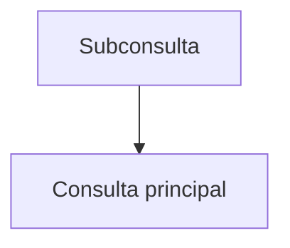

# Subconsultas

Una subconsulta es una instrucción `SELECT` anidada dentro de otra consulta. Puede utilizarse en `WHERE`, `FROM` o `SELECT` y puede ser correlacionada cuando depende de la fila externa.

## Ejemplo
```sql
SELECT nombre
FROM usuarios
WHERE id IN (
  SELECT usuario_id FROM ordenes WHERE total > 100
);
```

## Diagrama

