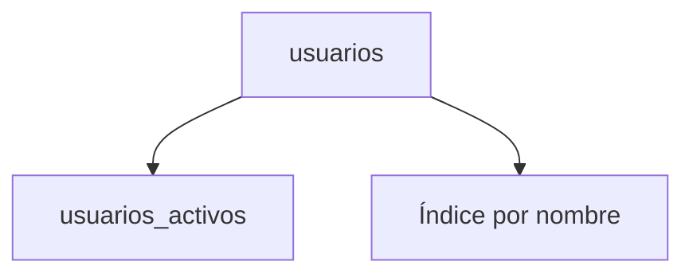

# Vistas e índices

Las vistas almacenan consultas para reutilizarlas y los índices aceleran búsquedas sobre columnas.

## Ejemplo
```sql
CREATE VIEW usuarios_activos AS
SELECT * FROM usuarios WHERE activo = true;
```

## Diagrama

