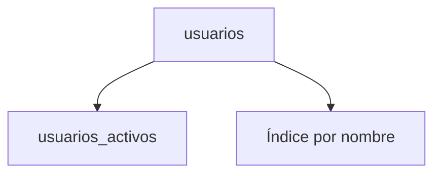

# Vistas e índices

Una vista es una consulta almacenada que actúa como tabla virtual y simplifica el acceso a datos complejos. Los índices son estructuras que mejoran el rendimiento de las búsquedas al evitar recorridos completos de la tabla.

## Preparación
Trabajaremos en la base `tienda` reutilizando las tablas `usuarios` y `ordenes` de lecciones previas.

## Ejemplo
```sql
CREATE VIEW usuarios_activos AS
SELECT id, nombre FROM usuarios WHERE activo = TRUE;

CREATE INDEX idx_usuarios_nombre ON usuarios(nombre);
```

## Diagrama


### CREATE VIEW
Define una consulta almacenada que se comporta como una tabla virtual.

```sql
CREATE VIEW usuarios_activos AS
SELECT id, nombre FROM usuarios WHERE activo = TRUE;
```

**Ejercicio**

Crear una vista `ordenes_mayores` que muestre las órdenes con `total` superior a 100.

**Solución paso a paso**

1. Escribir la consulta base `SELECT * FROM ordenes WHERE total > 100`.
2. Anteponer `CREATE VIEW ordenes_mayores AS` a dicha consulta.
3. Ejecutar:
   `CREATE VIEW ordenes_mayores AS SELECT * FROM ordenes WHERE total > 100;`.

### CREATE INDEX
Genera una estructura de búsqueda para acelerar consultas.

```sql
CREATE INDEX idx_usuarios_nombre ON usuarios(nombre);
```

**Ejercicio**

Crear un índice en la columna `correo` de la tabla `usuarios`.

**Solución paso a paso**

1. Identificar la tabla y columna: `usuarios(correo)`.
2. Elegir un nombre para el índice, por ejemplo `idx_usuarios_correo`.
3. Ejecutar:
   `CREATE INDEX idx_usuarios_correo ON usuarios(correo);`.

