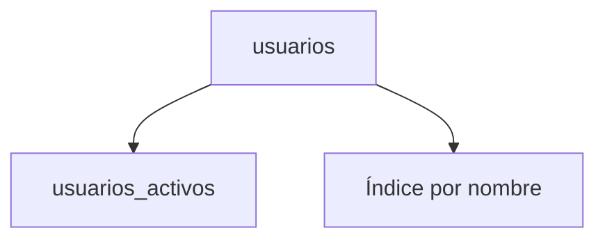

# Vistas e índices

Una vista es una consulta almacenada que actúa como tabla virtual y simplifica el acceso a datos complejos. Los índices son estructuras que mejoran el rendimiento de las búsquedas al evitar recorridos completos de la tabla.

## Ejemplo
```sql
CREATE VIEW usuarios_activos AS
SELECT id, nombre FROM usuarios WHERE activo = TRUE;

CREATE INDEX idx_usuarios_nombre ON usuarios(nombre);
```

## Diagrama

