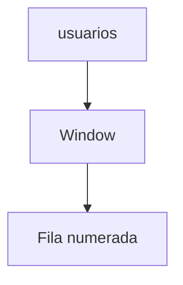

# Funciones avanzadas

Las funciones de ventana calculan valores sobre un conjunto de filas relacionadas manteniendo el detalle de los registros. También existen expresiones de tabla comunes (CTE) que permiten estructurar consultas complejas de forma legible.

## Ejemplo
```sql
WITH activos AS (
  SELECT id, nombre FROM usuarios WHERE activo = TRUE
)
SELECT nombre,
       ROW_NUMBER() OVER (ORDER BY id) AS posicion
FROM activos;
```

## Diagrama

