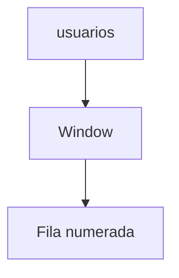

# Funciones avanzadas

Las funciones de ventana calculan valores sobre un conjunto de filas relacionadas manteniendo el detalle de los registros. También existen expresiones de tabla comunes (CTE) que permiten estructurar consultas complejas de forma legible.

## Preparación
Continuaremos con la base `tienda` y la tabla `usuarios` creada en lecciones anteriores.

## Ejemplo
```sql
WITH activos AS (
  SELECT id, nombre FROM usuarios WHERE activo = TRUE
)
SELECT nombre,
       ROW_NUMBER() OVER (ORDER BY id) AS posicion
FROM activos;
```

## Diagrama


### Funciones de ventana
Calculan valores sobre un conjunto de filas relacionado sin perder el detalle.

```sql
SELECT nombre,
       ROW_NUMBER() OVER (ORDER BY id) AS posicion
FROM usuarios;
```

**Ejercicio**

Enumerar a los usuarios activos según su `id`.

**Solución paso a paso**

1. Filtrar la tabla `usuarios` con `WHERE activo = TRUE`.
2. Aplicar `ROW_NUMBER()` con `OVER (ORDER BY id)`.
3. Ejecutar:
   `SELECT nombre, ROW_NUMBER() OVER (ORDER BY id) AS posicion FROM usuarios WHERE activo = TRUE;`.

### Expresiones de tabla comunes (CTE)
Permiten definir consultas auxiliares que pueden reutilizarse.

```sql
WITH activos AS (
  SELECT id, nombre FROM usuarios WHERE activo = TRUE
)
SELECT * FROM activos;
```

**Ejercicio**

Crear una CTE que obtenga los usuarios inactivos y luego los liste.

**Solución paso a paso**

1. Escribir la CTE `WITH inactivos AS (SELECT * FROM usuarios WHERE activo = FALSE)`.
2. Realizar un `SELECT * FROM inactivos` para usarla.
3. Ejecutar:
   `WITH inactivos AS (SELECT * FROM usuarios WHERE activo = FALSE) SELECT * FROM inactivos;`.

