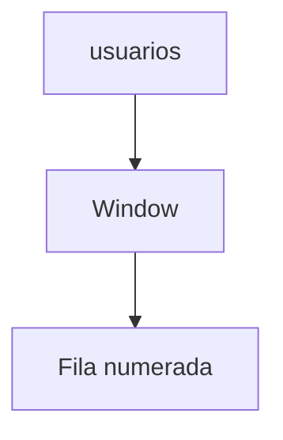

# Funciones avanzadas

Incluyen funciones de ventana que calculan valores sobre un conjunto de filas relacionadas.

## Ejemplo
```sql
SELECT nombre, ROW_NUMBER() OVER (ORDER BY id) FROM usuarios;
```

## Diagrama

