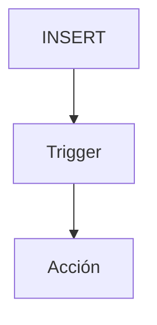

# Procedimientos almacenados y triggers

Los procedimientos almacenados son conjuntos de instrucciones SQL que se guardan en el servidor y se ejecutan bajo demanda, lo que facilita la reutilización y el control de la lógica de negocios. Los `triggers` se disparan automáticamente ante eventos como inserciones o actualizaciones.

## Preparación
Seguimos con la base `tienda` y la tabla `usuarios`. Para los ejemplos crea una tabla `log` donde registraremos acciones:

```sql
\c tienda
CREATE TABLE log (
  id SERIAL PRIMARY KEY,
  tabla TEXT,
  accion TEXT,
  fecha TIMESTAMP DEFAULT NOW()
);

CREATE TABLE auditoria (
  id SERIAL PRIMARY KEY,
  usuario_id INT,
  accion TEXT,
  fecha TIMESTAMP DEFAULT NOW()
);
```

## Ejemplo
```sql
CREATE OR REPLACE FUNCTION registrar_log() RETURNS TRIGGER AS $$
BEGIN
  INSERT INTO log(tabla, accion) VALUES ('usuarios', TG_OP);
  RETURN NEW;
END;
$$ LANGUAGE plpgsql;

CREATE TRIGGER log_insert
AFTER INSERT ON usuarios
FOR EACH ROW EXECUTE FUNCTION registrar_log();
```

## Diagrama


### Procedimiento almacenado
Es una función definida por el usuario que puede ejecutarse cuando se necesite.

```sql
CREATE OR REPLACE FUNCTION saludar(text) RETURNS text AS $$
BEGIN
  RETURN 'Hola, ' || $1;
END;
$$ LANGUAGE plpgsql;
```

**Ejercicio**

Crear un procedimiento que devuelva la cantidad de usuarios registrados.

**Solución paso a paso**

1. Definir la función con `RETURNS integer` y un nombre, por ejemplo `contar_usuarios`.
2. Dentro del bloque `BEGIN ... END` usar `SELECT COUNT(*) INTO res FROM usuarios;`.
3. Devolver el resultado con `RETURN res;`.
4. Ejecutar el procedimiento: `SELECT contar_usuarios();`.

### Trigger
Se ejecuta automáticamente ante eventos en una tabla.

```sql
CREATE TRIGGER log_insert
AFTER INSERT ON usuarios
FOR EACH ROW EXECUTE FUNCTION registrar_log();
```

**Ejercicio**

Crear un trigger que registre en una tabla `auditoria` las eliminaciones de la tabla `usuarios`.

**Solución paso a paso**

1. Escribir una función `registrar_borrado` que inserte en `auditoria` los datos del usuario eliminado.
2. Crear el trigger con `AFTER DELETE ON usuarios` que llame a `registrar_borrado`.
3. Ejecutar las sentencias correspondientes para definir la función y el trigger.

