# Procedimientos almacenados y triggers

Los procedimientos almacenados son conjuntos de instrucciones SQL que se guardan en el servidor y se ejecutan bajo demanda, lo que facilita la reutilización y el control de la lógica de negocios. Los `triggers` se disparan automáticamente ante eventos como inserciones o actualizaciones.

## Ejemplo
```sql
CREATE OR REPLACE FUNCTION registrar_log() RETURNS TRIGGER AS $$
BEGIN
  INSERT INTO log(tabla, accion) VALUES ('usuarios', TG_OP);
  RETURN NEW;
END;
$$ LANGUAGE plpgsql;

CREATE TRIGGER log_insert
AFTER INSERT ON usuarios
FOR EACH ROW EXECUTE FUNCTION registrar_log();
```

## Diagrama

```mermaid
graph TD;
  E[INSERT] --> T[Trigger];
  T --> A[Acción];
```

