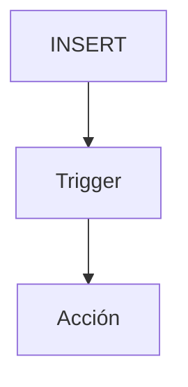

# Procedimientos almacenados y triggers

Los procedimientos almacenados son bloques de SQL reutilizables y los triggers se ejecutan automáticamente ante eventos.

## Ejemplo
```sql
CREATE TRIGGER log_insert
AFTER INSERT ON usuarios
FOR EACH ROW EXECUTE PROCEDURE registrar_log();
```

## Diagrama

