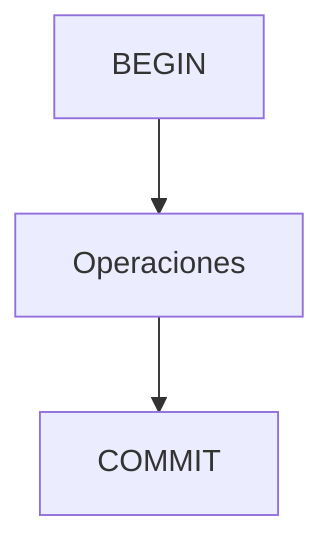

# Control de transacciones y concurrencia

Una transacción agrupa varias operaciones como una unidad atómica para cumplir las propiedades ACID (Atomicidad, Consistencia, Aislamiento y Durabilidad). Los mecanismos de concurrencia e aislamiento evitan conflictos cuando varios usuarios acceden simultáneamente a los datos.

## Preparación
Trabajaremos en la base `tienda`. Crea una tabla `cuentas` para simular movimientos:

```sql
\c tienda
CREATE TABLE cuentas (
  id SERIAL PRIMARY KEY,
  saldo NUMERIC
);

INSERT INTO cuentas (saldo) VALUES (1000), (500), (750), (300);
```

## Ejemplo
```sql
BEGIN;
UPDATE cuentas SET saldo = saldo - 100 WHERE id = 1;
UPDATE cuentas SET saldo = saldo + 100 WHERE id = 2;
COMMIT;
```

## Diagrama


### BEGIN y COMMIT
Inician y confirman una transacción que agrupa varias operaciones.

```sql
BEGIN;
  UPDATE cuentas SET saldo = saldo - 100 WHERE id = 1;
  UPDATE cuentas SET saldo = saldo + 100 WHERE id = 2;
COMMIT;
```

**Ejercicio**

Realizar una transferencia de 50 unidades de la cuenta 3 a la cuenta 4 utilizando una transacción.

**Solución paso a paso**

1. Escribir `BEGIN;` para iniciar la transacción.
2. Restar 50 del saldo de la cuenta 3.
3. Sumar 50 al saldo de la cuenta 4.
4. Confirmar con `COMMIT;`.
5. Ejecutar todo el bloque como se muestra arriba reemplazando los identificadores.

### ROLLBACK
Revierte los cambios realizados en la transacción actual.

```sql
BEGIN;
  UPDATE cuentas SET saldo = saldo - 100 WHERE id = 1;
  -- Error detectado
ROLLBACK;
```

**Ejercicio**

Iniciar una transacción que disminuya el saldo de la cuenta 1 pero luego cancelarla.

**Solución paso a paso**

1. Comenzar con `BEGIN;`.
2. Ejecutar `UPDATE cuentas SET saldo = saldo - 20 WHERE id = 1;`.
3. Decidir no aplicar los cambios y ejecutar `ROLLBACK;`.
4. Verificar que el saldo permanece igual.

