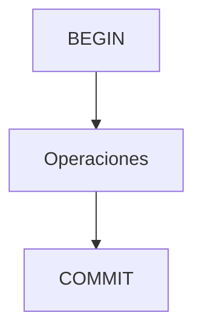

# Control de transacciones y concurrencia

Una transacción agrupa varias operaciones como una unidad atómica para cumplir las propiedades ACID (Atomicidad, Consistencia, Aislamiento y Durabilidad). Los mecanismos de concurrencia e aislamiento evitan conflictos cuando varios usuarios acceden simultáneamente a los datos.

## Ejemplo
```sql
BEGIN;
UPDATE cuentas SET saldo = saldo - 100 WHERE id = 1;
UPDATE cuentas SET saldo = saldo + 100 WHERE id = 2;
COMMIT;
```

## Diagrama

