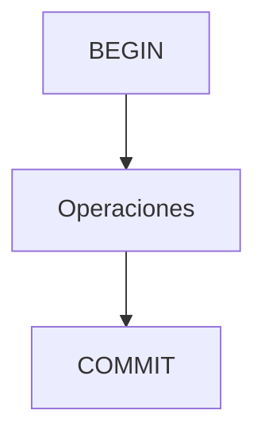

# Control de transacciones y concurrencia

Las transacciones agrupan operaciones para garantizar coherencia. COMMIT confirma y ROLLBACK revierte.

## Ejemplo
```sql
BEGIN;
UPDATE cuentas SET saldo = saldo - 100 WHERE id = 1;
UPDATE cuentas SET saldo = saldo + 100 WHERE id = 2;
COMMIT;
```

## Diagrama

