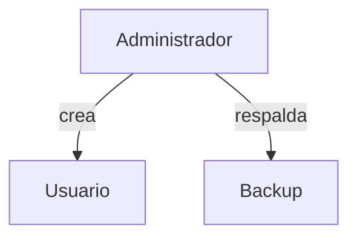

# Administración de bases de datos

La administración de un SGBD incluye la gestión de usuarios y permisos, la planificación de copias de seguridad y la monitorización del rendimiento. Un buen mantenimiento asegura disponibilidad y seguridad de la información.

## Ejemplo
```sql
CREATE USER invitado WITH PASSWORD 'segura';
GRANT SELECT ON usuarios TO invitado;
```

## Diagrama

