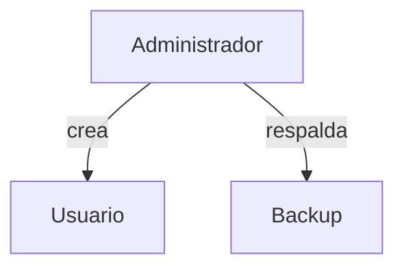

# Administración de bases de datos

La administración de un SGBD incluye la gestión de usuarios y permisos, la planificación de copias de seguridad y la monitorización del rendimiento. Un buen mantenimiento asegura disponibilidad y seguridad de la información.

## Preparación
Utilizaremos la base `tienda` y la tabla `usuarios` para aplicar permisos y ejemplos de administración.

## Ejemplo
```sql
CREATE USER invitado WITH PASSWORD 'segura';
GRANT SELECT ON usuarios TO invitado;
```

## Diagrama


### CREATE USER
Crea un nuevo usuario con las credenciales especificadas.

```sql
CREATE USER invitado WITH PASSWORD 'segura';
```

**Ejercicio**

Crear un usuario llamado `reportes` con contraseña `reporte123`.

**Solución paso a paso**

1. Usar la sentencia `CREATE USER` seguida del nombre `reportes`.
2. Añadir `WITH PASSWORD 'reporte123'` para definir la clave.
3. Ejecutar:
   `CREATE USER reportes WITH PASSWORD 'reporte123';`.

### GRANT
Otorga permisos sobre objetos a un usuario o rol.

```sql
GRANT SELECT ON usuarios TO invitado;
```

**Ejercicio**

Conceder permiso de inserción en la tabla `usuarios` al usuario `reportes`.

**Solución paso a paso**

1. Identificar la operación: `INSERT` sobre `usuarios`.
2. Especificar el usuario que recibirá el permiso: `reportes`.
3. Ejecutar:
   `GRANT INSERT ON usuarios TO reportes;`.

### Copia de seguridad
Respalda la información de la base de datos para su recuperación.

```bash
pg_dump -U admin basedatos > respaldo.sql
```

**Ejercicio**

Generar un respaldo de la base `tienda` en un archivo `tienda.sql`.

**Solución paso a paso**

1. Usar la utilidad `pg_dump` indicando el nombre de la base.
2. Redirigir la salida a un archivo `tienda.sql`.
3. Ejecutar:
   `pg_dump -U admin tienda > tienda.sql`.

