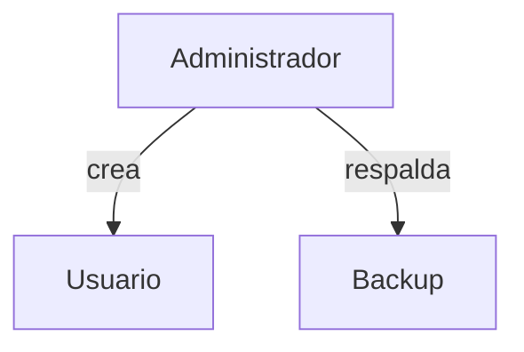

# Administración de bases de datos

Implica gestionar usuarios, respaldos y rendimiento del servidor.

## Ejemplo
```sql
CREATE USER invitado WITH PASSWORD 'segura';
```

## Diagrama

```mermaid
graph TD;
  A[Administrador] -->|crea| U[Usuario];
  A -->|respalda| B[Backup];
```
