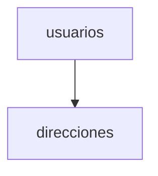

# Normalización y diseño de bases de datos

La normalización es un proceso de diseño que organiza los datos para reducir la redundancia y mejorar la integridad. Se basa en formas normales que determinan cómo deben dividirse las tablas según sus dependencias funcionales.

## Ejemplo
```sql
-- Separar la dirección en una tabla relacionada
CREATE TABLE direcciones (
  id SERIAL PRIMARY KEY,
  usuario_id INT REFERENCES usuarios(id),
  ciudad TEXT
);
```

## Diagrama

