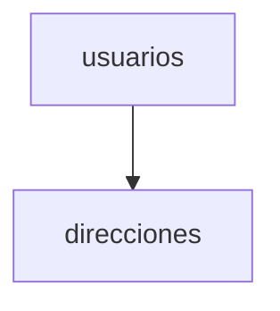

# Normalización y diseño de bases de datos

La normalización organiza tablas para reducir redundancia siguiendo formas normales.

## Ejemplo
```sql
-- Separar dirección en otra tabla
CREATE TABLE direcciones (
  id INT PRIMARY KEY,
  usuario_id INT,
  ciudad TEXT
);
```

## Diagrama

