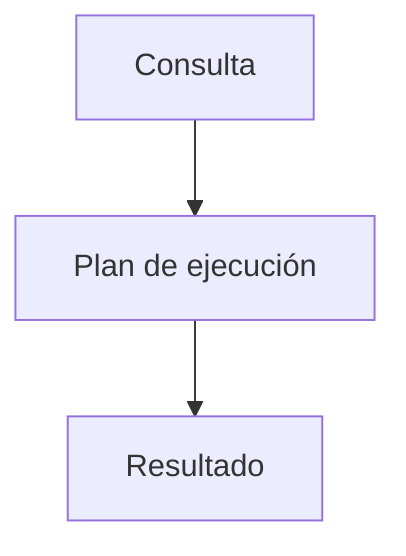

# Optimización de consultas

La optimización busca reducir el tiempo de respuesta de las consultas mediante el uso de índices, la reescritura de sentencias y el análisis de planes de ejecución. Un plan eficiente evita escaneos completos de tablas y aprovecha las estructuras disponibles.

## Ejemplo
```sql
EXPLAIN ANALYZE
SELECT * FROM usuarios WHERE nombre = 'Ana';
```

## Diagrama

