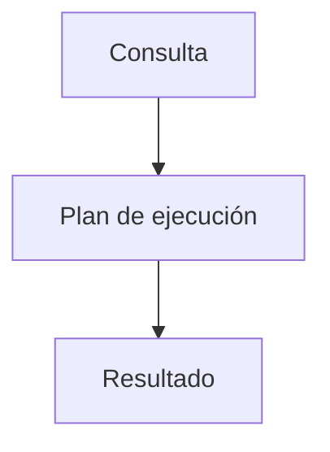

# Optimización de consultas

Mejorar el rendimiento usando índices y analizando planes de ejecución.

## Ejemplo
```sql
EXPLAIN SELECT * FROM usuarios WHERE nombre = 'Ana';
```

## Diagrama

```mermaid
graph TD;
  Q[Consulta] --> P[Plan de ejecución];
  P --> R[Resultado];
```
