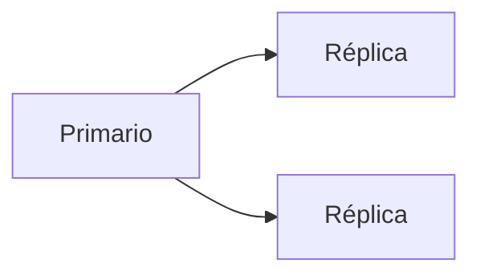

# Replicación, particionamiento y alta disponibilidad

Estas técnicas distribuyen datos entre servidores para mejorar rendimiento y tolerancia a fallos.

## Ejemplo
```sql
-- Configuración conceptual de réplica
-- PRIMARY y REPLICA sincronizados
```

## Diagrama

