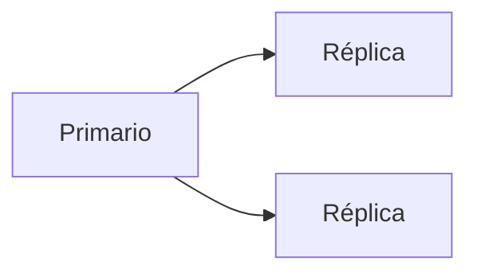

# Replicación, particionamiento y alta disponibilidad

La replicación copia datos de un servidor primario a uno o más secundarios para garantizar disponibilidad y recuperación ante fallos. El particionamiento divide tablas grandes en fragmentos más manejables, ya sea por rango o por hash, mejorando el rendimiento.

## Ejemplo
```sql
-- Creación de una tabla particionada por rango de fechas
CREATE TABLE ventas (
  id SERIAL,
  fecha DATE,
  total NUMERIC
) PARTITION BY RANGE (fecha);
```

## Diagrama

