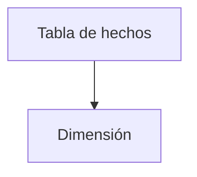

# SQL en entornos analíticos

Se usa para analizar grandes volúmenes de datos en almacenes y ejecutar agregaciones complejas.

## Ejemplo
```sql
SELECT region, SUM(ventas) FROM hechos GROUP BY region;
```

## Diagrama

