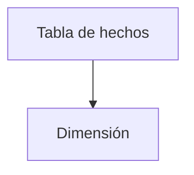

# SQL en entornos analíticos

En los sistemas analíticos, como los almacenes de datos, SQL se utiliza para procesar grandes volúmenes de información orientada a la toma de decisiones. Las consultas suelen implicar agregaciones complejas y el uso de tablas de hechos y dimensiones.

## Ejemplo
```sql
SELECT region, SUM(ventas) AS total
FROM hechos
GROUP BY region;
```

## Diagrama

