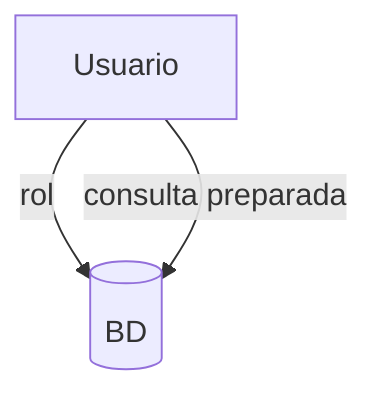

# Seguridad y buenas prácticas

Incluye gestión de permisos y uso de consultas preparadas para evitar inyecciones SQL.

## Ejemplo
```sql
PREPARE stmt AS SELECT * FROM usuarios WHERE id = $1;
```

## Diagrama

