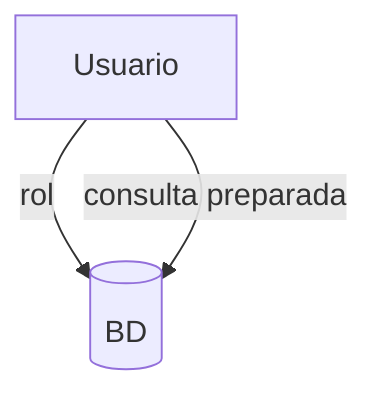

# Seguridad y buenas prácticas

La seguridad en bases de datos implica controlar el acceso mediante roles y privilegios, proteger la información sensible y prevenir ataques como la inyección SQL. El uso de consultas preparadas y la encriptación de datos son medidas comunes.

## Ejemplo
```sql
PREPARE stmt AS SELECT * FROM usuarios WHERE id = $1;
EXECUTE stmt(10);
```

## Diagrama

