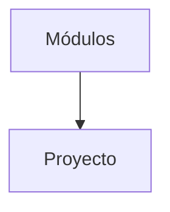

# Proyecto final

El proyecto final integra todos los conceptos del curso. Consiste en diseñar una base de datos completa, poblarla con datos de prueba y desarrollar consultas optimizadas aplicando medidas de seguridad y buenas prácticas.

## Ejemplo
```sql
-- Crear un esquema para el proyecto
CREATE SCHEMA proyecto;
SET search_path TO proyecto;
```

## Diagrama

